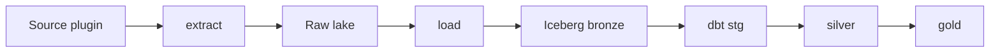

# DET — Data Extract Tool

Extract → **raw** (wire bytes) → **bronze** (typed Iceberg). **dbt** owns silver and gold.
**dlt never lands bronze** — it may help HTTP; DET owns validation, meta, and writers.

This repo is the `det` CLI plus example pipelines (NOAA, example_api, Open Library),
dbt models, optional local Airflow, and a read-only MCP server.

---

## Try it (fixtures, no NOAA download)

Python 3.12+ and [uv](https://github.com/astral-sh/uv):

```bash
uv venv && make install          # recommended extras (includes iceberg + examples)
export DET_LAKE_PATH="$PWD/data/lake"

uv run det run -p noaa.storm_events -s 2026-08-06 \
  --set source.overrides.local_csv_dir=fixtures/storm_events \
  --set source.overrides.filename_substr=details

uv run det dbt -p noaa.storm_events
duckdb data/analytics.duckdb -c "select * from gold.gold_yearly_damage"
```

You should see:

- Raw: `data/lake/raw/noaa/storm_events_v1/…/data/` + `meta/manifest.json`
- Bronze: Iceberg table at `data/lake/bronze/noaa/storm_events_v1/`
- Silver/gold in `data/analytics.duckdb`

`make run-local` is a **thin JSONL** smoke (`destination.type=filesystem`). It does not
feed Iceberg `iceberg_scan` in dbt. Use the commands above for the full path, or
`make all` only if you intend JSONL bronze.

Use `uv run det …` (or `make …`). If macOS hides the editable `.pth`, `make unhide` or
`PYTHONPATH=src .venv/bin/det …`.

---

## Mental model



| Layer | Owner | Rule |
| --- | --- | --- |
| Raw | DET | Append extract runs; rebuild source of truth |
| Bronze | DET | Typed landing; prune bronze only, never raw |
| Silver / gold | dbt | Dedupe and marts; latest extract wins |

**Interval:** `-s` inclusive start, `-e` exclusive end (default start + 1 day).
`det run` shares one `__extract_run_datetime` across raw, bronze, and rows.

---

## Install extras

Base `det` is the runtime + CLI (no Iceberg / DuckDB / example HTTP deps).
**Recommended first line:** install with the `iceberg` extra.

| Extra | For |
| --- | --- |
| `iceberg` | **Recommended** — default lake bronze |
| `examples` | In-tree HTTP sources (`dlt`, BeautifulSoup) |
| `duckdb` | DuckDB destination / DuckDB-backed prune |
| `scaffold` | Jinja2 dbt/pipeline scaffolding |
| `dbt` | `det dbt` |
| `postgres` | SQL serving destination |
| `s3` / `gcs` | Object-store lake URI |
| `mcp` | Cursor inspect / dry-run server |
| `dev` | pytest, ruff |

```bash
# App / embed (git until PyPI publish as det-elt):
uv pip install -e ".[iceberg]"              # recommended
uv pip install -e ".[iceberg,duckdb,dbt]"   # typical app repo
make install                                # this checkout (full extras)
make test
uv run det check
```

---

## Pipeline YAML

Canonical id is `provider.source` (`-p noaa.storm_events`). Defaults live in the
plugin; YAML wires schema, destination, and optional dbt knobs. Plugins are
discovered from `src/det/sources/<provider>/<source>.py` (`name` must equal
`provider.source`) — they are not listed in `plugins.py`. Out-of-tree packages may
use entry points `det.sources` / `det.mappers`.

```yaml
name: noaa.storm_events
source:
  type: noaa.storm_events
destination:
  type: iceberg          # default lake; filesystem = JSONL; duckdb / postgres = SQL
  partition: extract_run # Iceberg only; omit = extract_run; small tables: none
wire_version: 1          # lake id is always {name}_vN (including _v1)
```

Schema defaults to `schemas/<provider>/<source>/<source>.schema.yaml`.
Greenfield: `det init-pipeline --name example_api.events --source-type example_api.events`.

---

## Destinations

Lake root: `DET_LAKE_PATH` / `--lake-path` (default `./data/lake`). Same hive under
one root (`raw/` + `bronze/` prefixes) — dual buckets are not supported. There is
no `destination.type: s3`.

**`DET_LAKE_MODE`** (policy around the URI; unset → `local`):

| Mode | Allowed lake | Typical use |
| --- | --- | --- |
| `local` | filesystem path or `memory://` (tests) | laptop, CI default suite, Compose default |
| `cloud` | `s3://…` or `gs://…` / `gcs://…` | object store; CI MinIO soak covers extract→Iceberg→`iceberg_scan` and `det dbt` |

`--lake-path` cannot bypass mode. `det check` errors on mismatch and warns when
`mode=cloud`. Compose: `DET_LAKE_MODE` + overridable `DET_LAKE_PATH` (see
`airflow/.env.example`). Analytics/ops DuckDB stay on the worker filesystem.

| `destination.type` | Bronze |
| --- | --- |
| **`iceberg`** | Default. Parquet table at `<lake>/bronze/<provider>/<source>_vN/` |
| `filesystem` | Hive JSONL (thin / fixtures). Cannot share that path with Iceberg |
| `duckdb` | `bronze_{provider}.{source}_vN` — needs `connection` |
| `postgres` | Same SQL names — `connection_env: DET_POSTGRES_DSN` (never a DSN in YAML) |

Iceberg-only: `destination.partition` is `extract_run` (default — identity on
`__extract_run_datetime` for load replace / silver watermark) or `none`
(unpartitioned; use for small tables). Spec applies on **create** only. Live
mismatch **hard-fails** until `det migrate … --recreate-iceberg` (full table
purge, then rewrite `-s`/`-e` or `--all-raw`; latest raw per interval unless
`--all-raw-runs`) or a manual wipe. Not the raw hive layout.

`det dbt -p …` sets `DET_BRONZE_SOURCE` from the pipeline (`iceberg` → `iceberg_scan`
in `sources.yml`). On `s3://` lakes, `det dbt` auto-selects profile target
`duckdb_s3` (httpfs + S3 secret from the same `AWS_*` as extract/load). Layout contract: [docs/lake-layout.md](docs/lake-layout.md).

---

## Everyday CLI

`-p` is a canonical id, `provider/source`, or a YAML path. Project root:
`--project-root` > `DET_PROJECT_ROOT` > cwd.

```bash
det run -p noaa.storm_events -s 2026-08-06
det extract -p noaa.storm_events -s 2026-08-06
det load -p noaa.storm_events -s 2026-08-06
det dbt -p noaa.storm_events
det check
det list-pipelines
det list-sources
```

| Command | When |
| --- | --- |
| `det prune -p … -s … --keep 1 --dry-run` then `--apply` | Drop old bronze extract-run siblings (never raw) |
| `det migrate -p … --to-bronze … --schema … --mapper identity -s … -e …` | Rebuild bronze from raw after a contract change |
| `det scaffold-dbt -p …` | Emit stg/silver + `sources.yml` |
| `det runs` / `det runs-materialize` | Attempt receipts; optional ops Iceberg + `det dbt --select tag:ops` |
| `det lock-show` / `lock-release --force` | Lake lease on `(pipeline, interval)` if a worker died |

Logs: console on a laptop TTY, JSON off TTY (`DET_LOG_FORMAT`). Secrets: names in
YAML (`auth_env`, `connection_env`); values in env. `det check` fails passwordful DSNs
in committed config.

---

## dbt

```bash
det dbt -p noaa.storm_events    # stg_<provider>__<source>+ ; sets lake env
det dbt                         # full analytics project (excludes tag:ops)
```

Scaffolded `stg_*` use `det_bronze_from`. Gold is hand-written. Nested flatten /
relations: `dbt.stg` in pipeline YAML, then `det scaffold-dbt -p …`. More:
[`.cursor/skills/det-dbt/SKILL.md`](.cursor/skills/det-dbt/SKILL.md).

---

## Local Airflow (dev only)

```bash
make airflow-up          # http://localhost:8080  — airflow / airflow
make airflow-down
```

Compose is **LocalExecutor**, not production. DAGs: extract → load, silver/gold dbt,
ops receipts — decoupled. Env: `airflow/.env.example`. Guide:
[`.cursor/skills/det-airflow/SKILL.md`](.cursor/skills/det-airflow/SKILL.md).

---

## Cube (local semantic layer)

Gold and ops metrics for agents. Not Cube Cloud MCP.

```bash
make cube-up             # http://localhost:4000
make cube-down
```

Compose reads `data/analytics.duckdb` (`yearly_damage`) and `data/det_ops.duckdb`
(`run_daily`). Copy `cube/.env.example` → `cube/.env`. MCP: `cube_meta` /
`cube_load` (`DET_CUBE_BASE_URL`, `DET_CUBE_API_SECRET`). Do not run `det dbt`
against a DuckDB file Cube has open. Certified metrics go through Cube; silver
or ops row detail uses MCP `query_analytics`.

---

## MCP (Cursor)

Read-only inspect + dry-run (no extract/load/prune-apply/DagRuns).
`uv pip install -e ".[mcp]"`; [`.cursor/mcp.json`](.cursor/mcp.json) already launches it.
Agent contract: [AGENTS.md](AGENTS.md). Tools + policy:
[`.cursor/rules/det-mcp.mdc`](.cursor/rules/det-mcp.mdc).

---

## Repo map

```text
src/det/                 CLI, runtime, example sources, writers
configs/pipelines/       provider.source YAML
schemas/                 bronze JSON Schema
docs/lake-layout.md      hive / SQL compatibility
docs/api.md              public Python API (SemVer / __all__)
dbt/                     silver + gold + ops
cube/                    local Cube Core (gold + ops metrics)
dags/ + airflow/         local Compose
fixtures/                offline NOAA CSVs
```

Example sources implement `extract_to_raw` / `records_from_raw`. Land near-wire bytes;
unexpected fields fail JSON Schema. Analytics renames live in `dbt.stg`. True wire
breaks bump `wire_version`. dlt: `RESTClient` / `@dlt.resource` as iterators only —
never `dlt.pipeline` for landing.

---

## Troubleshooting

| Symptom | Fix |
| --- | --- |
| `No module named 'det'` | `make unhide` or `PYTHONPATH=src .venv/bin/det` (macOS hidden `.pth`) |
| `dbt CLI not found` | `uv run det dbt` so the venv `dbt` is on PATH |
| `No raw partitions` | Load the **same** `-s`/`-e` you extracted |
| Iceberg partition YAML ≠ live | `det migrate … --recreate-iceberg` (or wipe the bronze table path); plain load/migrate hard-fails |
| Iceberg dbt vs JSONL lake | Don’t mix `make run-local` (filesystem) with `det dbt -p` (pipeline is iceberg) |
| DuckDB lock in Airflow | Absolute `DET_ANALYTICS_DUCKDB`; one dbt process at a time |
| Cube MCP `cube_unavailable` | `make cube-up`; copy `cube/.env.example` → `cube/.env` |
| DuckDB lock with Cube | Do not `det dbt` while Cube has that file open |
| `DET_LAKE_MODE=local forbids…` / `requires an s3://` | Align mode and path: local + filesystem, or cloud + `s3://`/`gs://` |
