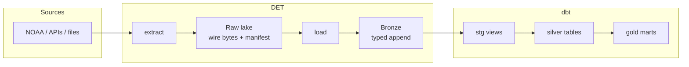
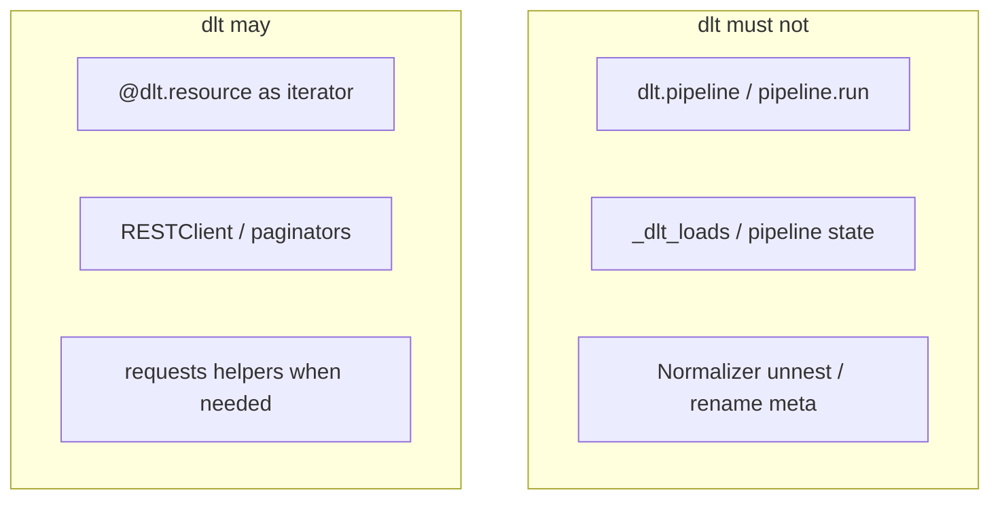
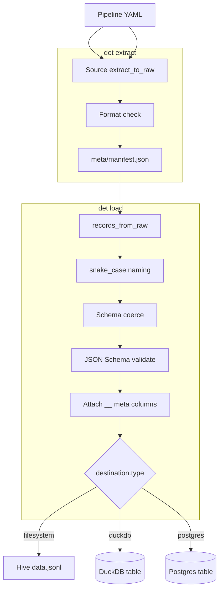
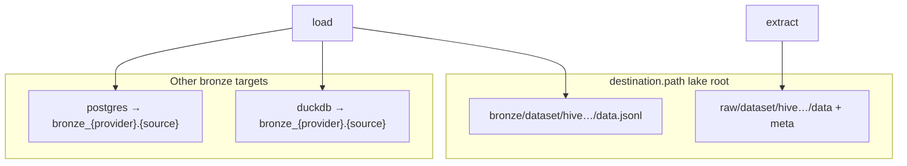
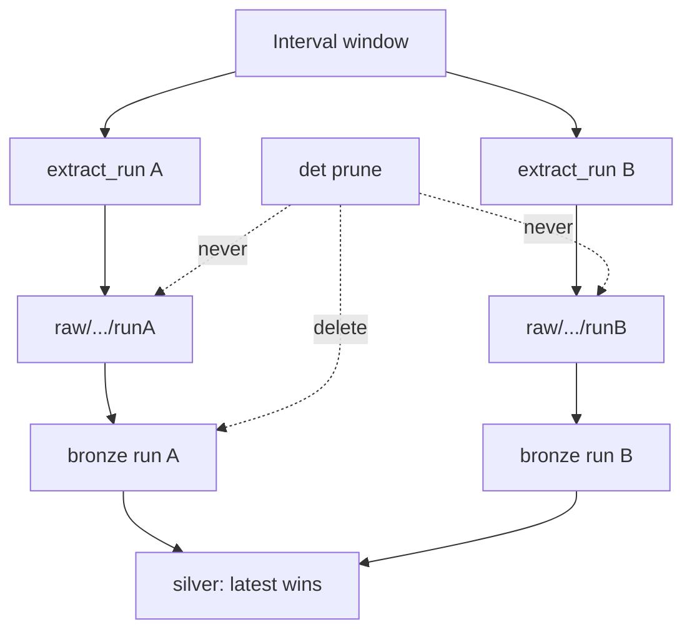
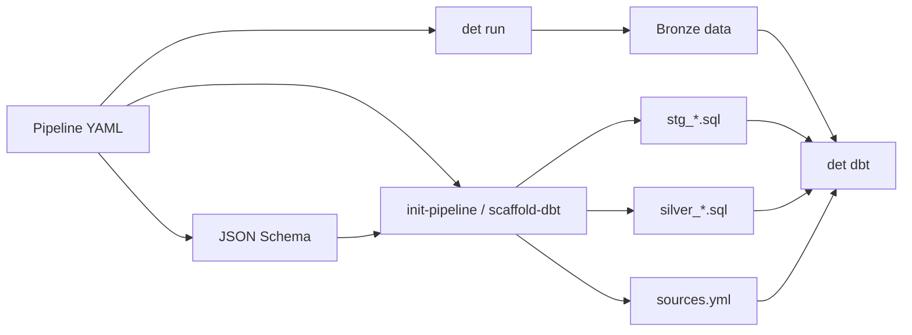
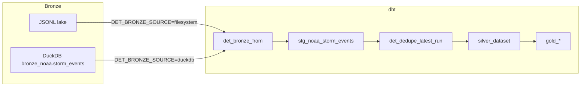
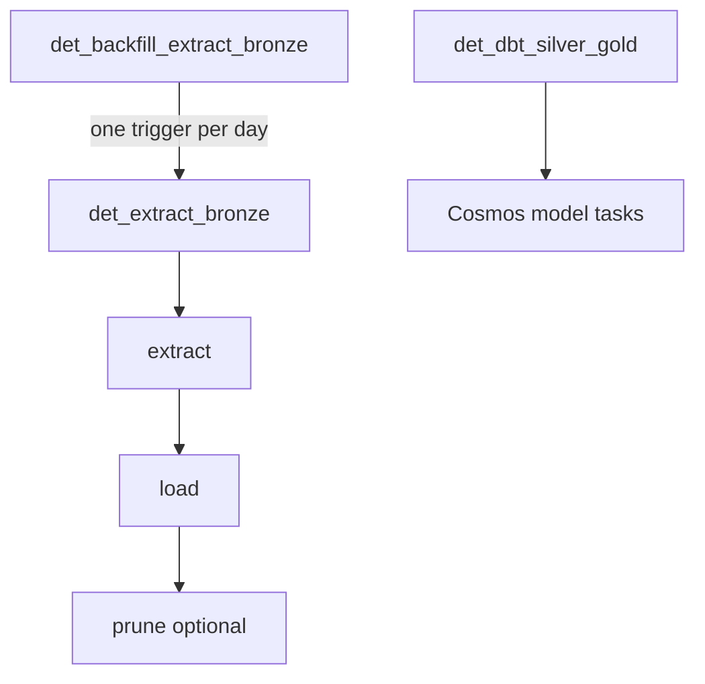

# DET — Data Extract Tool

Config-driven extract → raw → bronze runtime with pluggable sources and destinations.
This repo ships the **`det` CLI**, first-party disaster/NOAA pipelines, dbt silver/gold,
optional Airflow DAGs, and a Cursor MCP server for inspect + dry-run ops.

**DET owns raw and bronze. dbt owns silver and gold. dlt never lands bronze.**

---

## Contents

1. [At a glance](#at-a-glance)
2. [Mental model](#mental-model)
3. [How a run works](#how-a-run-works)
4. [Lake layout](#lake-layout)
5. [Install](#install)
6. [Follow along (local E2E)](#follow-along-local-e2e)
7. [Pipeline YAML](#pipeline-yaml)
8. [CLI reference](#cli-reference)
9. [Destinations](#destinations)
10. [Schemas, coerce, and meta](#schemas-coerce-and-meta)
11. [Prune (bronze only)](#prune-bronze-only)
12. [dbt (silver / gold)](#dbt-silver--gold)
13. [Migrate](#migrate)
14. [MCP (Cursor)](#mcp-cursor)
15. [Airflow](#airflow)
16. [Tests](#tests)
17. [Troubleshooting](#troubleshooting)
18. [Repository layout](#repository-layout)

---

## At a glance

| Command | What it does |
| --- | --- |
| `det extract` | Source → raw `data/` + format check + `meta/manifest.json` |
| `det load` | Raw → snake_case → coerce → JSON Schema → bronze |
| `det run` | Extract then load with one shared run-start stamp |
| `det prune` | Bronze retention (`--dry-run` or `--apply`; never touches raw) |
| `det migrate` | Rebuild bronze from raw (`--dry-run` to preview) |
| `det scaffold-dbt` | Generate `sources.yml` + `stg_*` + `silver_*` from schema |
| `det init-pipeline` | Greenfield pipeline YAML + schema stub + scaffold-dbt |
| `det dbt` | Run dbt (`build` / `run` / `test`) for local testing |
| `det list-pipelines` | Canonical ids under `configs/pipelines/` |
| `det list-sources` / `list-mappers` | Discover plugins |
| `det check` | Structure check (schema/source; dbt models warn) |

Also:

- **Destinations** — filesystem JSONL (default), DuckDB append, or Postgres append
- **Hive partitions** — interval start/end + extract run under `raw/` and `bronze/`
- **dlt boundaries** — extract helpers only; DET owns validation, meta, and writers
- **Local Airflow** — `make airflow-up` (Compose UI + Cosmos dbt graph); extract and dbt DAGs are decoupled

---

## Mental model

DET stops at bronze. Cleaning, dedupe, and marts live in dbt. dlt is never the bronze writer.



**Ownership rules**

| Layer | Owner | Mutability |
| --- | --- | --- |
| Raw | DET | Append-only extract runs; source of truth for rebuilds |
| Bronze | DET | Append-only extract runs; prune drops old bronze only |
| Silver / gold | dbt | Transform + dedupe; latest extract wins |



---

## How a run works

`det run` shares one `__extract_run_datetime` across raw path, bronze path, and every row.



**Interval window**

| Flag | Meaning |
| --- | --- |
| `-s` / `--interval-start` | Inclusive start (required). `YYYY-MM-DD` or ISO datetime |
| `-e` / `--interval-end` | Exclusive end (defaults to start + 1 day) |

---

## Lake layout

Raw always lands under `destination.path`. Bronze landing depends on `destination.type`.



Filesystem layout:

```text
data/lake/raw/noaa/storm_events/
  __interval_start_datetime=20260801T000000Z/
    __interval_end_datetime=20260802T000000Z/
      __extract_run_datetime=20260806T232208Z/
        data/                 # source payload bytes
        meta/manifest.json

data/lake/bronze/noaa/storm_events/          # filesystem destination only
  __interval_start_datetime=…/
    __interval_end_datetime=…/
      __extract_run_datetime=…/
        data.jsonl
```

Partition values are compact UTC (`20260801T000000Z`) because paths cannot hold `/` or `:`.
Re-runs append a sibling extract-run folder; they do not overwrite.



---

## Install

Requires Python 3.12+ and [uv](https://github.com/astral-sh/uv).

```bash
cd det
uv venv
make install          # editable install + macOS .pth unhide
# Optional extras:
# uv pip install -e ".[postgres]"   # Postgres bronze writer
# uv pip install -e ".[mcp]"        # Cursor MCP server
```

| Extra | Adds |
| --- | --- |
| `dev` | pytest, ruff |
| `dbt` | dbt-core, dbt-duckdb |
| `postgres` | psycopg |
| `mcp` | FastMCP stdio server |

Prefer one of these when invoking the CLI so the venv `dbt` binary is found:

```bash
make …                              # uses uv run
PYTHONPATH=src .venv/bin/det …      # durable if editable .pth is hidden
uv run det …
```

---

## Follow along (local E2E)

This path uses **fixtures** (no NOAA download). You should finish with silver/gold rows
in DuckDB.

### 1. Install

```bash
uv venv && make install
```

### 2. Extract + load from fixtures

```bash
make run-local
# equivalent:
# uv run det run \
#   -p noaa.storm_events \
#   -s 2026-08-06 \
#   --set source.overrides.local_csv_dir=fixtures/storm_events \
#   --set source.overrides.filename_substr=details \
#   --set ingestion.library=thin
```

Expect:

- Raw under `data/lake/raw/noaa/storm_events/…/data/` + `meta/manifest.json`
- Bronze JSONL under `data/lake/bronze/noaa/storm_events/…/data.jsonl`

### 3. Build silver + gold

```bash
make dbt
# or: uv run det dbt -p noaa.storm_events
```

### 4. Query the mart

```bash
duckdb data/analytics.duckdb -c "select * from main_gold.gold_yearly_damage"
```

If you `ATTACH` from a bare DuckDB session, qualify as `analytics.main_gold.…` or
`USE analytics;` first.

### 5. One-liner for the whole path

```bash
make all          # run-local + dbt
make clean        # drop data/ and dbt artifacts
```

### 6. Optional: real NOAA window

```bash
PYTHONPATH=src .venv/bin/det run \
  -p noaa.storm_events \
  -s 2026-07-01 -e 2026-08-08

PYTHONPATH=src .venv/bin/det dbt \
  -p noaa.storm_events
```

### 7. Optional: preview then apply bronze prune

```bash
PYTHONPATH=src .venv/bin/det prune \
  -p noaa.storm_events \
  -s 2026-07-01 -e 2026-08-08 \
  --keep 1 --dry-run

PYTHONPATH=src .venv/bin/det prune \
  -p noaa.storm_events \
  -s 2026-07-01 -e 2026-08-08 \
  --keep 1 --apply
```

Raw extract runs stay on disk; only old bronze siblings are removed.

---

## Pipeline YAML

Source connection defaults live in Python plugins. YAML wires type, schema, ingestion,
destination, and optional `dbt.silver` knobs.

```yaml
name: noaa.storm_events
source:
  type: noaa.storm_events
# schema defaults to schemas/noaa/storm_events/storm_events.schema.yaml
validation:
  engine: jsonschema
ingestion:
  library: dlt                 # or thin (filesystem only)
destination:
  type: filesystem             # filesystem | duckdb | postgres
  path: ./data/lake            # always the raw lake root
  # connection: ./data/analytics.duckdb   # required for duckdb / postgres
  # dataset: bronze                       # medallion prefix → SQL bronze_{provider}
medallion:
  bronze_prefix: bronze
  raw_prefix: raw
dbt:
  silver:
    materialized: table        # table | incremental | view
    unique_key: [__row_hash]
    order_by: ["__extract_run_datetime desc"]
    incremental_strategy: delete+insert
    watermark: __extract_run_datetime
    lookback: null             # e.g. "3 days"
```

Canonical id is `provider.source` (e.g. `noaa.storm_events`). Lake path is `raw|bronze/{provider}/{source}/`. For DuckDB/Postgres, `destination.dataset` is the **medallion prefix** (default `bronze`) → SQL `bronze_noaa.storm_events`.



---

## CLI reference

`-p` accepts a **pipeline ref**: canonical id (`noaa.storm_events`), slash form (`noaa/storm_events`), or a YAML path. Resolution uses `--project-root`, else `DET_PROJECT_ROOT`, else cwd. Every command logs `pipeline=<id> path=configs/pipelines/...` to stderr.

```bash
# Extract / load / run
det run -p noaa.storm_events -s 2026-08-06
det extract -p noaa.storm_events -s 2026-08-06
det load -p noaa.storm_events -s 2026-08-06
det load -p noaa.storm_events -s 2026-07-01 -e 2026-08-08 \
  --extract-run-datetime 2026-08-08T18:21:12+00:00

# Overrides (dotted.key=yaml-value)
det run -p noaa.storm_events -s 2026-08-06 \
  --set ingestion.library=thin \
  --set source.overrides.local_csv_dir=fixtures/storm_events

# Bronze retention (exactly one of --dry-run or --apply)
det prune -p noaa.storm_events -s 2026-08-01 -e 2026-09-01 \
  --keep 1 --dry-run
det prune -p noaa.storm_events -s 2026-08-01 -e 2026-09-01 \
  --keep 1 --apply

# dbt (sets DET_LAKE_PATH + DET_BRONZE_SOURCE from the pipeline when -p is passed)
det dbt -p noaa.storm_events          # select stg_<provider>_<source>+
det dbt                                                 # full project build
det dbt --select silver_noaa_storm_events --command test
det dbt --dry-run

# Scaffold / greenfield
det scaffold-dbt -p noaa.storm_events --dry-run
det scaffold-dbt -p noaa.storm_events --force
det init-pipeline --name example_api.events --source-type example_api.events \
  --destination-type duckdb --connection ./data/analytics.duckdb

# Contract rebuild from raw
det migrate \
  -p example_api.events \
  --to-bronze example_api.events_v2 \
  --schema schemas/example_api/events/events_v2.schema.yaml \
  --mapper example_api_v1_to_v2 \
  -s 2026-08-01 -e 2026-09-01

det list-pipelines
det list-sources
det list-mappers
```

---

## Destinations

`destination.path` is always the **raw lake root**. Only bronze landing changes with `type`.

| type | Bronze write | Required knobs |
| --- | --- | --- |
| `filesystem` | Hive JSONL under `path/bronze/<provider>/<source>/` | `path` |
| `duckdb` | Append-only `{medallion}_{provider}.{source}` (e.g. `bronze_noaa.storm_events`) | `path`, `connection`, optional `dataset` (**medallion prefix**, default `bronze`) |
| `postgres` | Same SQL naming as DuckDB | `path`, `connection`, optional `dataset`; install `.[postgres]` |

**Breaking change:** `destination.dataset` is no longer the SQL schema name. It is the medallion prefix only; the SQL schema is `{dataset}_{provider}`.

```bash
det run -p noaa.storm_events -s 2026-08-06 \
  --set destination.type=duckdb \
  --set destination.connection=./data/analytics.duckdb \
  --set destination.dataset=bronze
# → bronze_noaa.storm_events
```

Use the **same** DuckDB file as `dbt/profiles.yml` when stg should read native tables.
`det dbt -p …` then sets `DET_BRONZE_SOURCE=duckdb`, `DET_BRONZE_SCHEMA=bronze_noaa`, and stg uses `det_bronze_from("storm_events")`.



---

## Schemas, coerce, and meta

Bronze schemas are **typed** JSON Schema under `schemas/`. DET applies **recursive**
snake_case naming (nested objects and arrays of objects keep the same shape; keys
are renamed in place), then **recursive** coerce, then validation (e.g. `"51.00"` →
number/integer when whole). Nested schema property names are the **post-naming**
contract (`lat_lon`, not `latLon`). Bronze does not flatten.

Silver may read nested paths as snake_case (`geo.lat_lon`). `det scaffold-dbt`
still emits top-level columns only.

Breaking note: on load/migrate, nested camelCase keys become snake_case. In-repo
pipelines today use flat schemas, so NOAA / example_api are unaffected.

```text
schemas/
  noaa/storm_events/storm_events.schema.yaml
  example_api/events/events.schema.yaml
  example_api/events/events_v2.schema.yaml
```

There is no `latest` pointer — the pipeline path is the contract. Breaking changes get a
new schema file + `det migrate` mapper.

### Meta columns (runtime-injected)

Not in JSON Schema. Added after validation (no `__raw` — rebuild from the raw lake):

| column | meaning |
| --- | --- |
| `__row_hash` | hash of canonical fields; default silver identity |
| `__filename` | source file when applicable |
| `__extract_run_datetime` | run-start, ISO 8601 UTC (row + path) |
| `__interval_start_datetime` | interval start, ISO 8601 UTC |
| `__interval_end_datetime` | interval end (exclusive), ISO 8601 UTC |
| `__data_interval_date` | `YYYY-MM-DD` from interval start (column only) |

---

## Prune (bronze only)

Re-runs append a new `__extract_run_datetime=…` sibling. Silver keeps the newest run per
identity key. Storage grows until you prune.

| Rule | Detail |
| --- | --- |
| Scope | Bronze only — never routine-prune `raw/` |
| Invocation | Explicit `det prune` (not part of `det run`) |
| Safety | Exactly one of `--dry-run` or `--apply` |
| Backends | Filesystem: delete old hive dirs; DuckDB/Postgres: `DELETE` by meta columns |

Airflow: set `DET_PRUNE=1` (and optionally `DET_PRUNE_APPLY=1`, `DET_PRUNE_KEEP=1`) on
the extract DAG to plan/apply prune after load.

---

## dbt (silver / gold)

```bash
det dbt -p noaa.storm_events
# or: make dbt
```

| Piece | Behavior |
| --- | --- |
| `sources.yml` | Filesystem bronze via `read_json_auto` + `DET_LAKE_PATH` |
| `det_bronze_from` | Switches stg to native DuckDB table when `DET_BRONZE_SOURCE=duckdb` |
| `stg_*` | View; schema-driven select + trim/nullif on strings |
| `silver_*` | Dedupe via `det_dedupe_latest_run` (identity + order from `dbt.silver`) |
| Gold | Hand-written only (never scaffolded) |

### scaffold-dbt / init-pipeline

`det scaffold-dbt` (create-if-missing; `--force` overwrites) emits:

- `sources.yml` table entry
- `stg_<dataset>.sql` / `silver_<dataset>.sql`
- `_silver__models.yml` tests

`det init-pipeline` creates `configs/pipelines/<name>.yaml`, a minimal schema under
`schemas/<name>/`, then runs scaffold-dbt.

---

## Migrate

Rebuild bronze from raw wire after a contract change (no dependence on a stored payload
column in bronze). Preview first with `--dry-run` (or MCP `migrate_dry_run`), then run
without `--dry-run` to write:

```bash
det migrate -p noaa.storm_events \
  --to-bronze noaa.storm_events_v2 \
  --schema schemas/noaa/storm_events/storm_events.schema.yaml \
  --mapper storm_events_identity \
  -s 2026-08-01 -e 2026-09-01 \
  --dry-run

det migrate -p noaa.storm_events \
  --to-bronze noaa.storm_events_v2 \
  --schema schemas/noaa/storm_events/storm_events.schema.yaml \
  --mapper storm_events_identity \
  -s 2026-08-01 -e 2026-09-01
```

| mapper | use when |
| --- | --- |
| `storm_events_identity` | named NOAA row already matches the target schema |
| `identity` | named row already matches |
| `example_api_v1_to_v2` | renames `severity` → `level` |

---

## MCP (Cursor)

Optional stdio server for agents: **read-only inspect + dry-run only** (no extract,
load, prune apply, or scaffold writes). Paths are sandboxed under `DET_PROJECT_ROOT`.

```bash
uv pip install -e ".[mcp]"
DET_PROJECT_ROOT=. PYTHONPATH=src .venv/bin/python -m det.mcp
```

Project wiring: [`.cursor/mcp.json`](.cursor/mcp.json) launches via `python -m det.mcp`
with `PYTHONPATH=src` (avoids macOS hidden-`.pth` import failures).

Companion docs:

- [`.cursor/rules/det-mcp.mdc`](.cursor/rules/det-mcp.mdc)
- [`.cursor/skills/det-ops/SKILL.md`](.cursor/skills/det-ops/SKILL.md)
- Skills: `det-migrate`, `det-new-source`, `det-airflow`, `det-dbt`

| Tools | Resources |
| --- | --- |
| `list_pipelines`, `list_sources`, `list_mappers`, `describe_pipeline` | `det://pipelines/{name}` |
| `list_raw_partitions`, `list_bronze_partitions`, `read_manifest` | `det://schemas/{dataset}/{filename}` |
| `diff_partitions`, `sample_raw`, `validate_sample`, `sample_bronze`, `diagnose_pipeline` | `det://readme` |
| `schema_from_sample_dry_run`, `mapper_from_diff_dry_run` | |
| `airflow_health`, `list_airflow_dags`, `list_airflow_dag_runs`, `describe_airflow_det_env`, `preview_backfill_conf` | |
| `migrate_dry_run`, `prune_dry_run`, `dbt_dry_run`, `scaffold_dbt_dry_run`, `init_pipeline_dry_run` | |

Sample size for `sample_*` / `validate_sample` is `limit` (default 5, max 50);
`diagnose_pipeline` uses `sample_limit`. Bronze samples are inspection-only —
rebuild via `det migrate` from raw.

**Generate (dry-run):** `schema_from_sample_dry_run` and `mapper_from_diff_dry_run`
return YAML/Python drafts only — write files after review, then `det migrate` /
`det init-pipeline` as needed.

**Airflow inspect (read-only):** defaults to local Compose
(`DET_AIRFLOW_BASE_URL=http://localhost:8080`). Override `DET_AIRFLOW_*` for a
remote Airflow later. MCP never triggers DagRuns.

Mutating steps stay on the CLI after you confirm (e.g. `det prune … --apply`).

---

## Airflow

DAGs under `dags/`. Local UI via Docker Compose (LocalExecutor — not production):

```bash
make airflow-up          # build image, migrate DB, start webserver + scheduler
# UI: http://localhost:8080  (airflow / airflow)
# First webserver boot can take 1–2 minutes before /health is ready.
make airflow-logs
make airflow-down
```

Config lives in `airflow/.env` (from `airflow/.env.example`). Leave
`DET_PIPELINE_OVERRIDES` empty for live NOAA; set the fixture overrides there
only when you want offline runs.

Cursor agents can inspect status via MCP (`airflow_health`, `list_airflow_dags`,
`list_airflow_dag_runs`, `describe_airflow_det_env`, `preview_backfill_conf`).
Agent→API connection (defaults match Compose):

| Env | Default |
| --- | --- |
| `DET_AIRFLOW_BASE_URL` | `http://localhost:8080` |
| `DET_AIRFLOW_USER` / `DET_AIRFLOW_PASSWORD` | from `airflow/.env` or `airflow` |
| `DET_AIRFLOW_AUTH` | `basic` (only mode today) |
| `DET_AIRFLOW_TIMEOUT_SEC` | `10` |



Extract and dbt are **decoupled**: bronze lands on its own schedule; silver/gold
runs on a separate `@daily` (or manual trigger after backfill).

| DAG | Flow |
| --- | --- |
| `det_extract_bronze` | extract → load → optional prune |
| `det_backfill_extract_bronze` | trigger `det_extract_bronze` once per day for `[interval_start, interval_end)` |
| `det_dbt_silver_gold` | scheduled Cosmos `DbtDag` (one Airflow task per dbt model/test; not chained from extract) |

dbt UI graph comes from [Astronomer Cosmos](https://github.com/astronomer/astronomer-cosmos)
(`astronomer-cosmos` in the Airflow image). Select matches `det dbt`
(`stg_{pipeline}+`). Env passed via Cosmos `ProjectConfig.env_vars`:
`DET_LAKE_PATH`, `DET_BRONZE_*`, and **`DET_ANALYTICS_DUCKDB`** (absolute path —
Cosmos clones the dbt project under `/tmp`, so relative DuckDB paths break).

Backfill (no UI form required) — DET half-open interval, one child DagRun per day:

```bash
make airflow-up   # if not already running
cd airflow && docker compose exec airflow-scheduler \
  airflow dags trigger det_backfill_extract_bronze --conf '{
    "interval_start": "2026-08-01",
    "interval_end": "2026-08-08"
  }'
```

Useful env vars (see `airflow/.env.example`): `DET_PROJECT_ROOT`,
`DET_PIPELINE_CONFIG`, `DET_PIPELINE_OVERRIDES`, `DET_DBT_PROJECT`,
`DET_LAKE_PATH`, `DET_ANALYTICS_DUCKDB`, `DET_BRONZE_SOURCE`, `DET_BRONZE_SCHEMA`,
`DET_PRUNE`, `DET_PRUNE_APPLY`, `DET_PRUNE_KEEP`.

---

## Tests

```bash
make test
# or: uv run pytest
```

Structure check (pipeline YAML loads, schema file exists, source registered;
missing dbt silver models are warnings):

```bash
uv run det check
# uv run det check -p noaa.storm_events --json
# uv run det check --strict   # also fail on warnings
```

CI runs `det check` (errors fail the job; warnings do not). Cursor
`afterFileEdit` hook under [`.cursor/hooks/`](.cursor/hooks/) surfaces the same
findings when agents edit `configs/pipelines/` or `schemas/`.

---

## Troubleshooting

**`ModuleNotFoundError: No module named 'det'`** after a successful install
(or MCP log: `from det.mcp.server import main` fails the same way).

Python 3.12+ skips `.pth` files with macOS `UF_HIDDEN`. Confirm with `ls -lO`
(`hidden` vs `-`) and fix:

```bash
make unhide   # or: make install
PYTHONPATH=src .venv/bin/det …
```

Cursor MCP already sets `PYTHONPATH=src` in `.cursor/mcp.json`.

**`dbt CLI not found`** when using `det dbt`.

Use the venv interpreter (`PYTHONPATH=src .venv/bin/det` or `uv run det`). DET looks
for `dbt` next to `sys.executable` (uv symlinks must not be fully resolved away).

**`det load` → `No raw partitions under …`**

Load needs an existing raw partition for the **exact** interval. List
`data/lake/raw/<dataset>/` or run `det extract` / `det run` for that window first.
MCP: `list_raw_partitions` / `read_manifest`.

**Cosmos / `det_dbt_silver_gold` → `Cannot open file "/tmp/data/analytics.duckdb"`**

Set `DET_ANALYTICS_DUCKDB` to an absolute path (Compose default:
`/opt/det/data/analytics.duckdb`). Relative paths in `dbt/profiles.yml` resolve
against Cosmos’s temp project clone, not the repo.

---

## Repository layout

```text
src/det/                 # DET package (CLI, runtime, sources, scaffold, writers)
src/det/mcp/             # optional FastMCP stdio server (.[mcp])
configs/pipelines/<provider>/  # pipeline YAML (provider.source)
schemas/<provider>/<source>/   # typed bronze JSON Schema
fixtures/                # sample extracts for local runs
dags/                    # Airflow DAGs (+ Cosmos dbt DAG)
airflow/                 # Local Compose (Dockerfile, docker-compose, .env.example)
dbt/                     # silver + gold + macros (+ profiles.yml)
.cursor/                 # mcp.json, rules, skills
tests/
```

### Sources and dlt boundaries

Plugins under `src/det/sources/` implement `defaults()`, `extract_to_raw(...)`, and
`records_from_raw(...)`.

**dlt is extraction only.** Allowed: `@dlt.resource` as an iterator, `rest_client`,
careful use of `requests`. Forbidden: `dlt.pipeline` / `pipeline.run` for landing,
dlt load/pipeline state, and normalizer unnesting. Landing is DET-owned
(`write_jsonl_partition`, `write_duckdb_table`, `write_postgres_table`).
