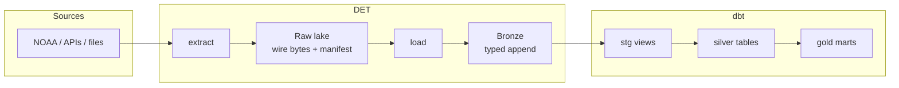
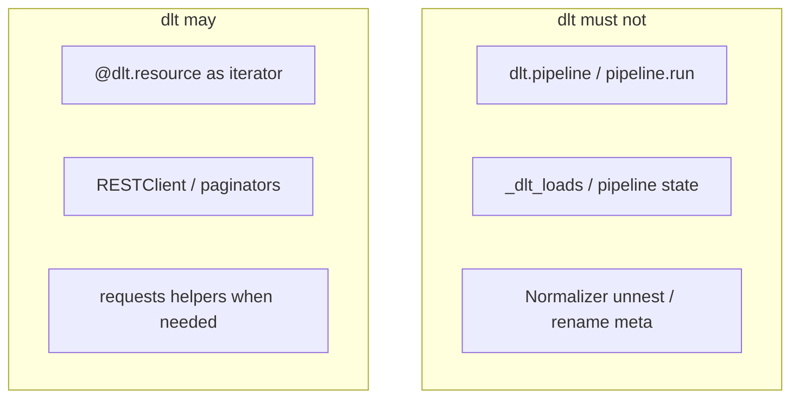
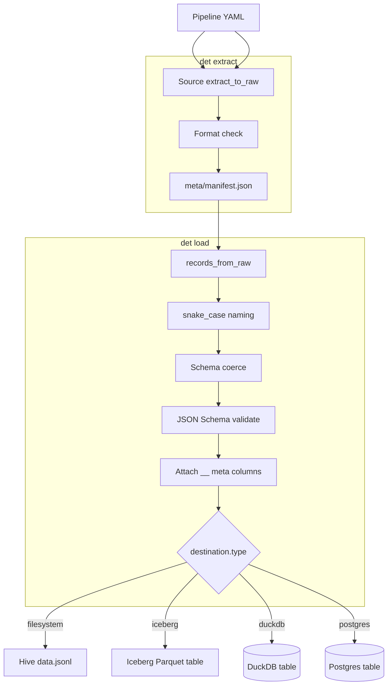
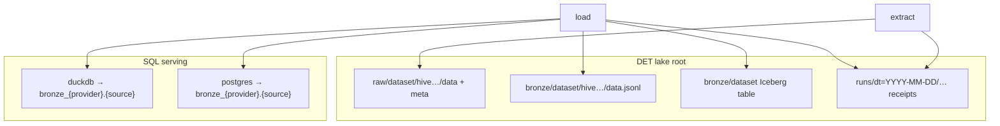
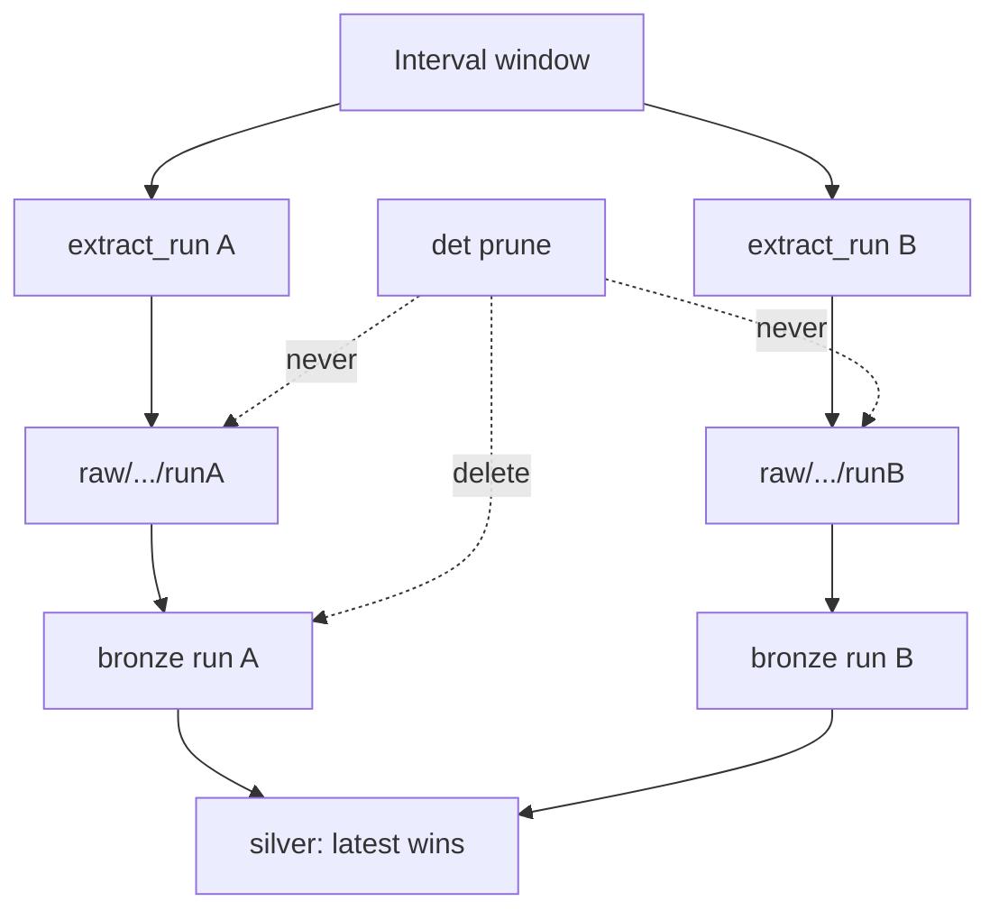
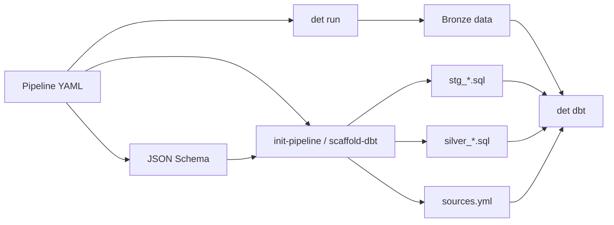
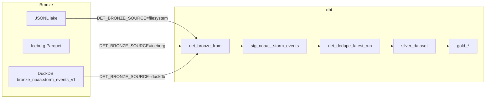
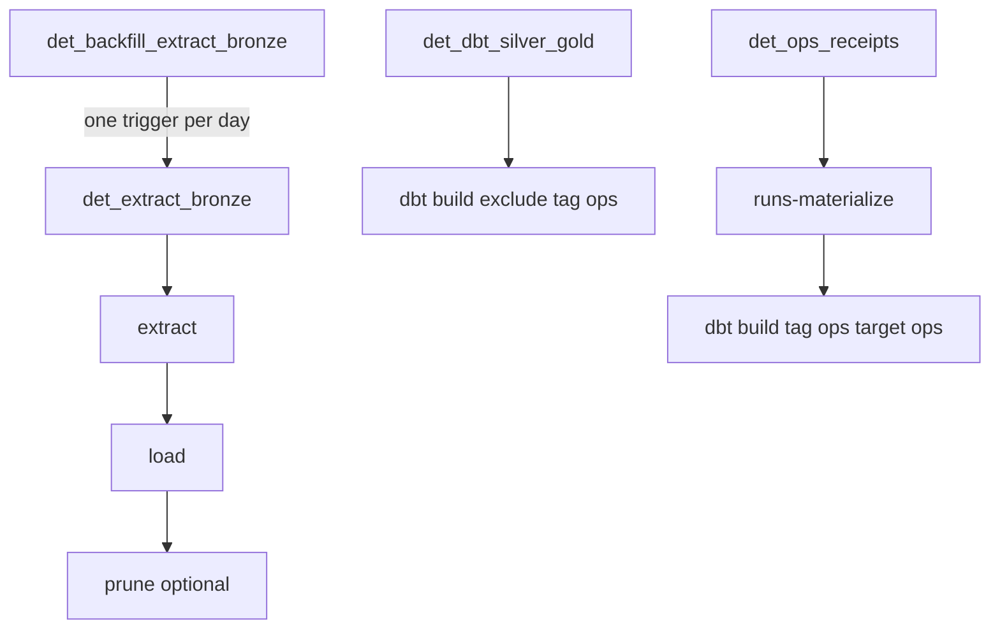

# DET — Data Extract Tool

Config-driven extract → raw → bronze runtime with pluggable sources and destinations.
This repo ships the **`det` CLI**, first-party disaster/NOAA pipelines, dbt silver/gold,
optional Airflow DAGs, and a Cursor MCP server for inspect + dry-run ops.

**DET owns raw and bronze. dbt owns silver and gold. dlt never lands bronze.**

---

## Contents

1. [At a glance](#at-a-glance)
2. [Mental model](#mental-model)
3. [How a run works](#how-a-run-works)
4. [Lake layout](#lake-layout)
5. [Run receipts](#run-receipts)
6. [Install](#install)
7. [Follow along (local E2E)](#follow-along-local-e2e)
8. [Pipeline YAML](#pipeline-yaml)
9. [CLI reference](#cli-reference)
10. [Destinations](#destinations)
11. [Secrets](#secrets)
12. [Schemas, coerce, and meta](#schemas-coerce-and-meta)
13. [Prune (bronze only)](#prune-bronze-only)
14. [dbt (silver / gold)](#dbt-silver--gold)
15. [Migrate](#migrate)
16. [MCP (Cursor)](#mcp-cursor)
17. [Airflow](#airflow)
18. [Tests](#tests)
19. [Troubleshooting](#troubleshooting)
20. [Repository layout](#repository-layout)

---

## At a glance

| Command | What it does |
| --- | --- |
| `det extract` | Source → raw `data/` + format check + `meta/manifest.json` |
| `det load` | Raw → snake_case → coerce → JSON Schema → bronze |
| `det run` | Extract then load with one shared run-start stamp |
| `det prune` | Bronze retention (`--dry-run` or `--apply`; never touches raw) |
| `det migrate` | Rebuild bronze from raw (`--dry-run` to preview) |
| `det scaffold-dbt` | Generate `sources.yml` + `stg_*` + `silver_*` from schema |
| `det init-pipeline` | Greenfield pipeline YAML + schema stub + scaffold-dbt |
| `det dbt` | Run dbt (`build` / `run` / `test`) for local testing |
| `det list-pipelines` | Canonical ids under `configs/pipelines/` |
| `det list-sources` / `list-mappers` | Discover plugins |
| `det check` | Structure check (schema/source; dbt models warn) |
| `det runs` | List extract/load receipts (status, duration, error code) |

Also:

- **Destinations** — Iceberg Parquet (default lake bronze), filesystem JSONL (opt-in), DuckDB, or Postgres
- **Hive partitions** — interval start/end + extract run under `raw/` and `bronze/`
- **dlt boundaries** — extract helpers only; DET owns validation, meta, and writers
- **Local Airflow** — `make airflow-up` (Compose UI); extract and dbt DAGs are decoupled

---

## Mental model

DET stops at bronze. Cleaning, dedupe, and marts live in dbt. dlt is never the bronze writer.



**Ownership rules**

| Layer | Owner | Mutability |
| --- | --- | --- |
| Raw | DET | Append-only extract runs; source of truth for rebuilds |
| Bronze | DET | Append-only extract runs; prune drops old bronze only |
| Silver / gold | dbt | Transform + dedupe; latest extract wins |



---

## How a run works

`det run` shares one `__extract_run_datetime` across raw path, bronze path, and every row.



**Interval window**

| Flag | Meaning |
| --- | --- |
| `-s` / `--interval-start` | Inclusive start (required). `YYYY-MM-DD` or ISO datetime |
| `-e` / `--interval-end` | Exclusive end (defaults to start + 1 day) |

---

## Lake layout

This is **layout 1** — the current hive, SQL names, and sibling prefixes. It is
not `wire_version` (dataset era `{name}_vN`) and not `receipt_version` (JSON
under `runs/`). New extracts stamp `lake_layout: 1` on `meta/manifest.json` and
on receipt JSON. Missing field ⇒ 1. Wipe `data/lake` (and `data/det_ops.duckdb`
for a clean ops DB) and re-extract; there is no layout migrator.

Raw always lands under the DET lake root (default `./data/lake`, override with
`DET_LAKE_PATH` or `--lake-path`). Bronze landing depends on `destination.type`.
There is no `destination.type: s3` — object storage is the same hive under
`s3://…` / `gs://…`.



Filesystem layout:

```text
data/lake/raw/noaa/storm_events_v1/
  __interval_start_datetime=20260801T000000Z/
    __interval_end_datetime=20260802T000000Z/
      __extract_run_datetime=20260806T232208Z/
        data/                 # source payload bytes
        meta/manifest.json    # extract metadata; lake_layout + wire_version;
                              # after successful load also
                              # validation: { ok, schema_path, schema_sha256, … }
                              # (receipt only — missing validation never gates load)

data/lake/bronze/noaa/storm_events_v1/       # iceberg (default) or filesystem JSONL
  __interval_start_datetime=…/
    __interval_end_datetime=…/
      __extract_run_datetime=…/
        data.jsonl

data/lake/runs/dt=2026-08-16/noaa.storm_events/
  extract__20260806T000000Z_20260807T000000Z__<attempt_id>.json
```

`runs/` is a sibling of `raw/`, `bronze/`, and `locks/`. Each file is one extract or
load attempt (success or failure). `dt=` is the **attempt date** (UTC wall clock),
not the data interval. See [Run receipts](#run-receipts).

Partition values are compact UTC (`20260801T000000Z`) because paths cannot hold `/` or `:`.
Re-runs append a sibling extract-run folder; they do not overwrite.



---

## Run receipts

`meta/manifest.json` records **what landed**. `{lake}/runs/` records **what happened**:
every `extract` and `load` attempt, including failures and timings. A failed extract
still deletes its incomplete partition (atomicity); the receipt lives outside that
prefix so the attempt survives.

Each attempt is one JSON object:

```text
{lake}/runs/dt=YYYY-MM-DD/{pipeline}/{command}__{interval_key}__{attempt_id}.json
```

- `dt=` is the UTC attempt date (a backfill of old data run today lands under today)
- `status` is `ok` or `error`; failures include a stable `error_code` (`http_error`,
  `lease_held`, `secret_not_set`, `schema_invalid`, …) plus a truncated, secret-scrubbed
  `error_message`
- `owner` reuses `DET_LOCK_OWNER` (Airflow sets `airflow:{dag_id}:{run_id}`)
- `destination` is the **type only** — never a DSN
- `det run` emits extract + load receipts, not a third combined one
- Writing a receipt never fails the run. `DET_RUN_RECEIPTS=0` disables writing.

```bash
det runs -p noaa.storm_events
det runs -p noaa.storm_events --status error
det runs --summary --json
det runs -s 2026-08-01 -e 2026-08-16   # attempt-date window, half-open, default last 7 days
```

MCP: `list_runs` / `summarize_runs` (read-only). Manifest remains the authority for
landed partitions; receipts are observability. `det prune` never touches `runs/`
(bronze-only).

Two questions:

- **This run** — receipts / `det runs`: did this extract or load break?
- **The fleet** — ops dbt SLOs: have opted-in pipelines been running often and well
  enough? Policy is `slo:` on pipeline YAML (opt-in). Extract/load do not read SLOs.
  `det check` errors `slo_seed_stale` when `dbt/seeds/ops_slo_expected.csv` drifts.
  Walk-through: DAG **`det_ops_receipts`** (`dbt build --select tag:ops --target ops`).

### Ops projection (Iceberg + dbt)

JSON under `runs/` stays the attempt log. Project a window into Iceberg for dbt:

```text
{lake}/ops/run_receipts   # namespace ops, table run_receipts, partition attempt_date
```

```bash
det runs-materialize -s 2026-08-01 -e 2026-08-17   # replace-by-day; needs det[iceberg]
det dbt --select tag:ops                           # --target ops + DET_LAKE_PATH
```

dbt models under `dbt/models/ops/` are tagged `ops` and land in a **separate** DuckDB
file (`DET_OPS_DUCKDB`, default `../data/det_ops.duckdb` / Compose `/opt/det/data/det_ops.duckdb`).
Do not name the file `ops.duckdb`: DuckDB uses the file stem as the catalog name, which
collides with schema `ops`.
Silver/gold builds always `--exclude tag:ops` so ops never writes `analytics.duckdb`.

Airflow DAG **`det_ops_receipts`** (standalone): materialize → `dbt build --select tag:ops --target ops`.
Not chained onto extract or `det_dbt_silver_gold`. That build seeds `ops_slo_expected`,
runs `det__ops_run_daily`, and the recency / error-rate / p95 / fail-closed tests.
`slo:` is opt-in (`cadence` plus sparse `extract` / `load` overlays; `false` skips a
command). v1: `noaa.storm_events` only.

---

## Install

Requires Python 3.12+ and [uv](https://github.com/astral-sh/uv).

```bash
cd det
uv venv
make install          # editable install + macOS .pth unhide (dev, dbt, mcp, postgres, iceberg)
# Optional extras if not using make install:
# uv pip install -e ".[iceberg]"    # Iceberg+Parquet bronze writer (already in make install)
```

| Extra | Adds |
| --- | --- |
| `dev` | pytest, ruff |
| `dbt` | dbt-core, dbt-duckdb |
| `postgres` | psycopg |
| `iceberg` | pyiceberg, pyarrow (Hadoop-style Iceberg bronze on the lake) |
| `mcp` | FastMCP stdio server |

Prefer one of these when invoking the CLI so the venv `dbt` binary is found:

```bash
make …                              # uses uv run
PYTHONPATH=src .venv/bin/det …      # durable if editable .pth is hidden
uv run det …
```

---

## Follow along (local E2E)

This path uses **fixtures** (no NOAA download). You should finish with silver/gold rows
in DuckDB.

### 1. Install

```bash
uv venv && make install
```

### 2. Extract + load from fixtures

```bash
make run-local
# equivalent:
# uv run det run \
#   -p noaa.storm_events \
#   -s 2026-08-06 \
#   --set source.overrides.local_csv_dir=fixtures/storm_events \
#   --set source.overrides.filename_substr=details \
#   --set ingestion.library=thin \
#   --set destination.type=filesystem
```

Expect:

- Raw under `data/lake/raw/noaa/storm_events/…/data/` + `meta/manifest.json`
- Bronze JSONL under `data/lake/bronze/noaa/storm_events/…/data.jsonl`

NOAA fatality CSVs use the same NCEI index with `filename_substr=fatalities-ftp`
(`noaa.fatalities`). Location CSVs use `filename_substr=locations-ftp`
(`noaa.locations`). Local smoke:

```bash
uv run det run -p noaa.fatalities -s 2026-08-06 \
  --set source.overrides.local_csv_dir=fixtures/fatalities \
  --set source.overrides.filename_substr=fatalities \
  --set ingestion.library=thin \
  --set destination.type=filesystem

uv run det run -p noaa.locations -s 2026-08-06 \
  --set source.overrides.local_csv_dir=fixtures/locations \
  --set source.overrides.filename_substr=locations \
  --set ingestion.library=thin \
  --set destination.type=filesystem
```

### 3. Build silver + gold

```bash
make dbt
# or: uv run det dbt -p noaa.storm_events
```

### 4. Query the mart

```bash
duckdb data/analytics.duckdb -c "select * from main_gold.gold_yearly_damage"
```

If you `ATTACH` from a bare DuckDB session, qualify as `analytics.main_gold.…` or
`USE analytics;` first.

### 5. One-liner for the whole path

```bash
make all          # run-local + dbt
make clean        # drop data/ and dbt artifacts
```

### 6. Optional: real NOAA window

```bash
PYTHONPATH=src .venv/bin/det run \
  -p noaa.storm_events \
  -s 2026-07-01 -e 2026-08-08

PYTHONPATH=src .venv/bin/det dbt \
  -p noaa.storm_events
```

### 7. Optional: preview then apply bronze prune

```bash
PYTHONPATH=src .venv/bin/det prune \
  -p noaa.storm_events \
  -s 2026-07-01 -e 2026-08-08 \
  --keep 1 --dry-run

PYTHONPATH=src .venv/bin/det prune \
  -p noaa.storm_events \
  -s 2026-07-01 -e 2026-08-08 \
  --keep 1 --apply
```

Raw extract runs stay on disk; only old bronze siblings are removed.

---

## Pipeline YAML

Source connection defaults live in Python plugins. YAML wires type, schema, ingestion,
destination, and optional `dbt.silver` knobs.

```yaml
name: noaa.storm_events
source:
  type: noaa.storm_events
# schema defaults to schemas/noaa/storm_events/storm_events.schema.yaml
validation:
  engine: jsonschema
ingestion:
  library: det                 # det (default) | dlt (alias) | thin (filesystem only)
destination:
  type: iceberg                # iceberg (default lake) | filesystem (JSONL) | duckdb | postgres
  # connection: ./data/analytics.duckdb   # duckdb file path (required for duckdb)
  # connection_env: DET_POSTGRES_DSN      # postgres: env var name, never the DSN
  # dataset: bronze                       # medallion prefix → SQL bronze_{provider}
medallion:
  bronze_prefix: bronze
  raw_prefix: raw
dbt:
  silver:
    materialized: table        # table | incremental | view
    unique_key: [__row_hash]
    order_by: ["__extract_run_datetime desc"]
    incremental_strategy: delete+insert
    watermark: __extract_run_datetime
    lookback: null             # e.g. "3 days"
```

Canonical id for `-p` / registry is `provider.source` (e.g. `noaa.storm_events`).
Lake / SQL dataset id is always `{name}_v{wire_version}` (including `_v1`), e.g.
`raw|bronze/noaa/storm_events_v1/` and DuckDB/Postgres `bronze_noaa.storm_events_v1`.
`destination.dataset` is the **medallion prefix** only (default `bronze`).
Top-level pipeline `dataset:` is rejected — bump `wire_version` for cutovers.



---

## CLI reference

`-p` accepts a **pipeline ref**: canonical id (`noaa.storm_events`), slash form (`noaa/storm_events`), or a YAML path. Resolution uses `--project-root`, else `DET_PROJECT_ROOT`, else cwd. Every command logs `pipeline=<id> path=configs/pipelines/...` to stderr.

Logs: laptop TTY stays human console. Non-TTY (Airflow, CI, pipes) is JSON with bound `pipeline`, `interval_start` / `interval_end`, `extract_run_datetime`, `destination` (type only), and `command` on extract/load/migrate/prune/dbt lines. Override with `--log-format json|console` or `DET_LOG_FORMAT` (CLI wins). Grep `pipeline` / `extract_run_datetime`. Compose sets `DET_LOG_FORMAT=json`.

Extract/load/run take a lake lease on `(pipeline, interval)` under `{lake}/locks/…` so two writers cannot share a window (CLI vs Airflow included). Different days can run in parallel. Override TTL with `--lock-ttl-sec` or `DET_LOCK_TTL_SEC` (default 7200). `LeaseHeldError` means a live lease; kill the worker, then `det lock-release -p … -s … --force` (or the manual `det_clear_lock` DAG). Do not clear a lock while the job is still running. `DET_LOCK=0` disables the lease (tests only; unsafe). Prune leases the command’s resolved `[start, end)` only — a month prune can still overlap a one-day load.

Every extract/load attempt also writes a run receipt under `{lake}/runs/` (status, duration, error code). `det runs` lists them; see [Run receipts](#run-receipts). `DET_RUN_RECEIPTS=0` disables writing.

```bash
# Extract / load / run
det run -p noaa.storm_events -s 2026-08-06
det run -p noaa.storm_events -s 2026-08-06 --lock-ttl-sec 21600
det extract -p noaa.storm_events -s 2026-08-06
det load -p noaa.storm_events -s 2026-08-06
det load -p noaa.storm_events -s 2026-07-01 -e 2026-08-08 \
  --extract-run-datetime 2026-08-08T18:21:12+00:00

det lock-show -p noaa.storm_events -s 2026-08-06
det lock-release -p noaa.storm_events -s 2026-08-06 --force

det runs -p noaa.storm_events
det runs -p noaa.storm_events --status error --summary
det runs --json                      # fleet-wide, last 7 attempt-days


# Overrides (dotted.key=yaml-value)
det run -p noaa.storm_events -s 2026-08-06 \
  --set ingestion.library=thin \
  --set source.overrides.local_csv_dir=fixtures/storm_events

# Bronze retention (exactly one of --dry-run or --apply)
det prune -p noaa.storm_events -s 2026-08-01 -e 2026-09-01 \
  --keep 1 --dry-run
det prune -p noaa.storm_events -s 2026-08-01 -e 2026-09-01 \
  --keep 1 --apply

# dbt (sets DET_LAKE_PATH + DET_BRONZE_SOURCE from the pipeline when -p is passed)
det dbt -p noaa.storm_events          # select stg_<provider>__<source>+
det dbt                                                 # full project build
det dbt --select silver_noaa__storm_events --command test
det dbt --dry-run

# Scaffold / greenfield
det scaffold-dbt -p noaa.storm_events --dry-run
det scaffold-dbt -p noaa.storm_events --force
det init-pipeline --name example_api.events --source-type example_api.events \
  --destination-type duckdb --connection ./data/analytics.duckdb

# Rebuild bronze from raw (same lake id; analytics renames live in dbt.stg)
det migrate \
  -p example_api.events \
  --to-bronze example_api.events_v1 \
  --schema schemas/example_api/events/events.schema.yaml \
  --mapper identity \
  -s 2026-08-01 -e 2026-09-01

det list-pipelines
det list-sources
det list-mappers
```

---

## Destinations

The lake root is DET runtime, not a per-pipeline field. Default is project-relative
`./data/lake`. Override with `--lake-path`, a rare `destination.path`, or
`DET_LAKE_PATH` (first hit wins in that order). Same hive keys on local disk,
`s3://bucket/prefix`, or `gs://bucket/prefix` (install `.[s3]` / `.[gcs]`).

Only bronze landing changes with `destination.type`. **`iceberg` is the default lake
bronze**: Iceberg table of Parquet files on the same lake root (Hadoop-style catalog:
warehouse is the lake, table at `<lake>/bronze/<provider>/<source>_vN/`). Install
`.[iceberg]` (`make install` includes it). BigQuery can **register** that table later
as a reader (BigLake / Iceberg managed table); DET does not add
`destination.type: bigquery` or dual-load a clone.
`type: filesystem` is explicit hive JSONL (thin, fixtures, `make run-local`). On object
storage it is supported for DET I/O; dbt `read_json('…/**/data.jsonl')` globs are
local-only — Iceberg bronze uses `iceberg_scan` instead.

| type | Bronze write | Required knobs |
| --- | --- | --- |
| `iceberg` | **Default lake bronze.** Iceberg table at `<lake>/bronze/<provider>/<source>_vN/` (Parquet + metadata; not JSONL hive folders) | — ; install `.[iceberg]` (`pyiceberg`, `pyarrow`) |
| `filesystem` | Opt-in hive JSONL under the same path | — |
| `duckdb` | `{medallion}_{provider}.{source}_vN` (e.g. `bronze_noaa.storm_events_v1`) | `connection`, optional `dataset` (**medallion prefix**, default `bronze`) |
| `postgres` | Same SQL naming as DuckDB | `connection_env` (see [Secrets](#secrets)), optional `dataset`; install `.[postgres]` |

**Breaking change:** `destination.dataset` is no longer the SQL schema name. It is the medallion prefix only; the SQL schema is `{dataset}_{provider}`. Lake table/path leaf is `{source}_v{wire_version}`.

```bash
det run -p noaa.storm_events -s 2026-08-06 \
  --set destination.type=duckdb \
  --set destination.connection=./data/analytics.duckdb \
  --set destination.dataset=bronze
# → bronze_noaa.storm_events_v1
```

Use the **same** DuckDB file as `dbt/profiles.yml` when stg should read native tables.
`det dbt -p …` then sets `DET_BRONZE_SOURCE=duckdb`, `DET_BRONZE_SCHEMA=bronze_noaa`, and stg uses `det_bronze_from("storm_events_v1")`. For Iceberg, `det dbt -p …` sets `DET_BRONZE_SOURCE=iceberg` and stg reads `iceberg_scan('<lake>/bronze/…')` from `sources.yml`.



---

## Secrets

Config carries **names**; the process environment carries **values**. Nothing
credential-shaped belongs in a committed YAML.

| Where | Field | Example |
| --- | --- | --- |
| Source credential | `auth_env` in plugin `defaults()` (or `source.overrides`) | `auth_env: EXAMPLE_API_TOKEN` |
| Postgres DSN | `destination.connection_env` | `connection_env: DET_POSTGRES_DSN` |
| Public source | `auth_env: null` | NOAA, Open Library |

A secret id defaults to the **provider, uppercased**, so one secret serves every
dataset of that provider. Lookup order for `example_api.events` is the declared
`auth_env`, then `DET_EXAMPLE_API`, then `EXAMPLE_API` (the `DET_` form avoids
collisions on shared workers).

A stored value is either the credential itself or a JSON object:

```bash
export DET_EXAMPLE_API='tok-abc123'
export DET_EXAMPLE_API='{"token": "tok-abc123"}'      # same thing
export DET_POSTGRES_DSN='postgresql://det:pw@db:5432/det'
```

Readable keys are `value`, `token`, `api_key`, `dsn`, `client_id`,
`client_secret`, `username`, `password`. HTTP asks `token` → `api_key` → `value`;
Postgres asks `dsn` → `value`. Other keys (`host`, `base_url`, …) are ignored with
one warning — hosts and paths stay in plugin `defaults()` and YAML, never in the
secret. DET never assembles a DSN from parts.

A source that declares auth and cannot resolve it **fails the run**; it never
downgrades to an unauthenticated request. Resolved values are cached ~300s
(`DET_SECRETS_TTL_SEC`) so a long backfill picks up a rotation, and a 401/403
triggers one re-resolve and retry.

Local debugging without exporting by hand: set `DET_SECRETS_BACKEND=file` and
point `DET_SECRETS_FILE` at a gitignored `NAME=value` file (default
`.env.secrets`). Env always wins over the file, DET refuses to read a file that
is inside the repo and not gitignored, and cloud deployments keep injecting env
from their own secret manager (no boto3/GCP client here).

`det check` fails on a passwordful DSN in YAML, on object-store credentials in
`destination.path`, and on credential-named literals in `source.overrides`. Logs
scrub resolved values and any embedded URI credentials, including inside
exception text. MCP `describe_pipeline` reports the secret **name**; MCP resolves
names from process env only and never returns a value.

---

## Schemas, coerce, and meta

Bronze schemas are **typed** JSON Schema under `schemas/`. DET applies **recursive**
snake_case naming (nested objects and arrays of objects keep the same shape; keys
are renamed in place), then **recursive** coerce, then validation (e.g. `"51.00"` →
number/integer when whole). Nested schema property names are the **post-naming**
contract (`lat_lon`, not `latLon`). Bronze does not flatten.

Silver may read nested paths as snake_case (`geo.lat_lon`). `det scaffold-dbt`
still emits top-level columns only.

Breaking note: on load/migrate, nested camelCase keys become snake_case. In-repo
pipelines today use flat schemas, so NOAA / example_api are unaffected.

```text
schemas/
  noaa/storm_events/storm_events.schema.yaml
  example_api/events/events.schema.yaml
```

There is no `latest` pointer — the pipeline path is the contract. Prefer `dbt.stg` for
renames; use a migrate mapper only when the bronze lake contract itself must change.

### Meta columns (runtime-injected)

Not in JSON Schema. Added after validation (no `__raw` — rebuild from the raw lake):

| column | meaning |
| --- | --- |
| `__row_hash` | hash of canonical fields; default silver identity |
| `__filename` | source file when applicable |
| `__extract_run_datetime` | run-start, ISO 8601 UTC (row + path) |
| `__bronze_loaded_at` | wall-clock UTC when this bronze batch was written (DET load/migrate) |
| `__interval_start_datetime` | interval start, ISO 8601 UTC |
| `__interval_end_datetime` | interval end (exclusive), ISO 8601 UTC |
| `__data_interval_date` | `YYYY-MM-DD` from interval start (column only) |

`__extract_run_datetime` is the shared extract/load run identity (and hive key).
`__bronze_loaded_at` is when DET finished validating and writing that bronze batch
(can differ when `det load` runs later than `det extract`).

Silver models (scaffold) also stamp:

| column | meaning |
| --- | --- |
| `__silver_processed_at` | this silver build timestamp |
| `__silver_updated_at` | last silver write; matches processed today under full rebuild / delete+insert |

---

## Prune (bronze only)

Re-runs append a new `__extract_run_datetime=…` sibling. Silver keeps the newest run per
identity key. Storage grows until you prune.

| Rule | Detail |
| --- | --- |
| Scope | Bronze only — never routine-prune `raw/` |
| Invocation | Explicit `det prune` (not part of `det run`) |
| Safety | Exactly one of `--dry-run` or `--apply` |
| Backends | Filesystem: delete old hive dirs; DuckDB/Postgres: `DELETE` by meta columns |

Airflow: set `DET_PRUNE=1` (and optionally `DET_PRUNE_APPLY=1`, `DET_PRUNE_KEEP=1`) on
the extract DAG to plan/apply prune after load.

---

## dbt (silver / gold)

```bash
det dbt -p noaa.storm_events
# or: make dbt
```

| Piece | Behavior |
| --- | --- |
| `sources.yml` | Filesystem bronze via schema-aware `read_json` + `DET_LAKE_PATH` |
| `det_bronze_from` | Switches stg to native DuckDB table when `DET_BRONZE_SOURCE=duckdb` |
| SQL schemas | Bronze `bronze_{provider}`; stg/silver `silver_{provider}` (model `config(schema=…)`, not `dbt_project.yml +schema`); gold `gold`. `generate_schema_name` keeps custom schemas as-is (no `main_silver_*` prefix). |
| `stg_*` | View; schema-driven select + `dbt.stg` flatten/adaptations |
| `silver_*` | Dedupe via `det_dedupe_latest_run` (identity + order from `dbt.silver`) |
| Gold | Hand-written only (never scaffolded) |

`dbt.stg.flatten` promotes nested structs onto the parent (`shipping_address.city` →
`shipping_address__city`; depth default unlimited). Nested struct adaptations live under
`dbt.stg.fields` with **relative** keys (scoped rename keeps the path prefix). Arrays
become child models only when listed under `dbt.stg.relations`
(`stg_<provider>__<source>__<relation>`); relation `materialized` (default `view`)
applies to both child stg and silver, and relations may declare their own
`not_null` / `unique` / `accepted_values`. `view_warn` samples the lake and warns when a
view relation looks large (advisory only).

Showcase: `example_api.orders` (built-in fixture orders) — try
`det run -p example_api.orders -s 2026-01-01 -e 2026-01-02`. Scaffold silver with
`det scaffold-dbt -p example_api.orders` when you want stg/silver models.

### scaffold-dbt / init-pipeline

`det scaffold-dbt` (create-if-missing; `--force` overwrites) emits:

- `sources.yml` table entry
- `stg_<provider>__<source>.sql` / `silver_<provider>__<source>.sql`
- optional relation models when `dbt.stg.relations` is set
- `_silver__models.yml` tests

`det init-pipeline` creates `configs/pipelines/<name>.yaml`, a minimal schema under
`schemas/<name>/`, then runs scaffold-dbt.

---

## Migrate

Rebuild bronze from raw wire after a contract change (no dependence on a stored payload
column in bronze). Preview first with `--dry-run` (or MCP `migrate_dry_run`), then run
without `--dry-run` to write:

```bash
det migrate -p noaa.storm_events \
  --to-bronze noaa.storm_events_v2 \
  --schema schemas/noaa/storm_events/storm_events.schema.yaml \
  --mapper identity \
  -s 2026-08-01 -e 2026-09-01 \
  --dry-run

det migrate -p noaa.storm_events \
  --to-bronze noaa.storm_events_v2 \
  --schema schemas/noaa/storm_events/storm_events.schema.yaml \
  --mapper identity \
  -s 2026-08-01 -e 2026-09-01
```

| mapper | use when |
| --- | --- |
| `identity` | named row already matches the target schema |
| `example_api_v1_to_v2` | renames `severity` → `level` |

---

## MCP (Cursor)

Optional stdio server for agents: **read-only inspect + dry-run only** (no extract,
load, prune apply, or scaffold writes). Paths are sandboxed under `DET_PROJECT_ROOT`.

```bash
uv pip install -e ".[mcp]"
DET_PROJECT_ROOT=. PYTHONPATH=src .venv/bin/python -m det.mcp
```

Project wiring: [`.cursor/mcp.json`](.cursor/mcp.json) launches via `python -m det.mcp`
with `PYTHONPATH=src` (avoids macOS hidden-`.pth` import failures).

Companion docs:

- [`.cursor/rules/det-mcp.mdc`](.cursor/rules/det-mcp.mdc)
- [`.cursor/skills/det-ops/SKILL.md`](.cursor/skills/det-ops/SKILL.md)
- Skills: `det-migrate`, `det-new-source`, `det-airflow`, `det-dbt`

| Tools | Resources |
| --- | --- |
| `list_pipelines`, `list_sources`, `list_mappers`, `describe_pipeline` | `det://pipelines/{name}` |
| `list_raw_partitions`, `list_bronze_partitions`, `read_manifest` | `det://schemas/{dataset}/{filename}` |
| `list_runs`, `summarize_runs` | |
| `diff_partitions`, `sample_raw`, `validate_sample`, `sample_bronze`, `diagnose_pipeline` | `det://readme` |
| `schema_from_sample_dry_run`, `mapper_from_diff_dry_run` | |
| `airflow_health`, `list_airflow_dags`, `list_airflow_dag_runs`, `describe_airflow_det_env`, `preview_backfill_conf` | |
| `migrate_dry_run`, `prune_dry_run`, `dbt_dry_run`, `scaffold_dbt_dry_run`, `init_pipeline_dry_run` | |

Sample size for `sample_*` / `validate_sample` is `limit` (default 5, max 50);
`diagnose_pipeline` uses `sample_limit`. Bronze samples are inspection-only —
rebuild via `det migrate` from raw.

**Generate (dry-run):** `schema_from_sample_dry_run` and `mapper_from_diff_dry_run`
return YAML/Python drafts only — write files after review, then `det migrate` /
`det init-pipeline` as needed.

**Airflow inspect (read-only):** defaults to local Compose
(`DET_AIRFLOW_BASE_URL=http://localhost:8080`). Override `DET_AIRFLOW_*` for a
remote Airflow later. MCP never triggers DagRuns.

Mutating steps stay on the CLI after you confirm (e.g. `det prune … --apply`).

---

## Airflow

DAGs under `dags/`. Local UI via Docker Compose (LocalExecutor — not production):

```bash
make airflow-up          # build image, migrate DB, start webserver + scheduler
# UI: http://localhost:8080  (airflow / airflow)
# First webserver boot can take 1–2 minutes before /health is ready.
make airflow-logs
make airflow-down
```

Config lives in `airflow/.env` (from `airflow/.env.example`). Leave
`DET_PIPELINE_OVERRIDES` empty for live NOAA; set the fixture overrides there
only when you want offline runs.

Cursor agents can inspect status via MCP (`airflow_health`, `list_airflow_dags`,
`list_airflow_dag_runs`, `describe_airflow_det_env`, `preview_backfill_conf`).
Agent→API connection (defaults match Compose):

| Env | Default |
| --- | --- |
| `DET_AIRFLOW_BASE_URL` | `http://localhost:8080` |
| `DET_AIRFLOW_USER` / `DET_AIRFLOW_PASSWORD` | from `airflow/.env` or `airflow` |
| `DET_AIRFLOW_AUTH` | `basic` (only mode today) |
| `DET_AIRFLOW_TIMEOUT_SEC` | `10` |



Extract, silver/gold, and ops are **decoupled** schedules.

| DAG | Flow |
| --- | --- |
| `det_extract_bronze` | extract → load → optional prune |
| `det_backfill_extract_bronze` | trigger `det_extract_bronze` once per day for `[interval_start, interval_end)` |
| `det_dbt_silver_gold` | one Airflow task: `dbt build` on analytics DuckDB with `--exclude tag:ops` |
| `det_ops_receipts` | materialize `runs/` → Iceberg `ops.run_receipts`, then `dbt build --select tag:ops --target ops` (seed + daily mart + SLO tests) on `DET_OPS_DUCKDB` |

File-backed DuckDB only allows a single writer, so each dbt DAG is **one process**
(same as local `det dbt`), not parallel per-model Cosmos tasks. Silver/gold always
`--exclude tag:ops` (even when `DET_DBT_SELECT` is set). Ops models run only on
`det_ops_receipts` / `--target ops`. Task env: `DET_LAKE_PATH`, `DET_BRONZE_*`,
**`DET_ANALYTICS_DUCKDB`**, and for ops **`DET_OPS_DUCKDB`** (prefer absolute in Compose).

Backfill (no UI form required) — DET half-open interval, one child DagRun per day:

```bash
make airflow-up   # if not already running
cd airflow && docker compose exec airflow-scheduler \
  airflow dags trigger det_backfill_extract_bronze --conf '{
    "interval_start": "2026-08-01",
    "interval_end": "2026-08-08"
  }'
```

Useful env vars (see `airflow/.env.example`): `DET_PROJECT_ROOT`,
`DET_PIPELINE_CONFIG`, `DET_PIPELINE_OVERRIDES`, `DET_DBT_PROJECT`,
`DET_DBT_SELECT`, `DET_LAKE_PATH`, `DET_LOG_FORMAT`, `DET_ANALYTICS_DUCKDB`, `DET_OPS_DUCKDB`, `DET_BRONZE_SOURCE`,
`DET_BRONZE_SCHEMA`, `DET_PRUNE`, `DET_PRUNE_APPLY`, `DET_PRUNE_KEEP`,
`DET_LOCK_TTL_SEC`, `DET_LOCK_OWNER`. `DET_LOCK=0` is unsafe (disables the lake lease).

---

## Tests

```bash
make test
# or: uv run pytest
```

Structure check (pipeline YAML loads, schema file exists, source registered;
missing dbt silver models are warnings):

```bash
uv run det check
# uv run det check -p noaa.storm_events --json
# uv run det check --strict   # also fail on warnings
```

CI (`uv sync --extra dev --extra mcp --extra dbt --extra postgres`) runs ruff,
`det check`, a grep for committed `scheme://user:pass@` credentials under
`configs/` and `dbt/`, `dbt parse`, and pytest. The live Postgres load+retry test needs
`DET_POSTGRES_DSN` (set in GitHub Actions); local pytest skips it when unset.
Cursor `afterFileEdit` hook under [`.cursor/hooks/`](.cursor/hooks/) surfaces
the same `det check` findings when agents edit `configs/pipelines/` or `schemas/`.

---

## Troubleshooting

**`ModuleNotFoundError: No module named 'det'`** after a successful install
(or MCP log: `from det.mcp.server import main` fails the same way).

Python 3.12+ skips `.pth` files with macOS `UF_HIDDEN`. Confirm with `ls -lO`
(`hidden` vs `-`) and fix:

```bash
make unhide   # or: make install
PYTHONPATH=src .venv/bin/det …
```

Cursor MCP already sets `PYTHONPATH=src` in `.cursor/mcp.json`.

**`dbt CLI not found`** when using `det dbt`.

Use the venv interpreter (`PYTHONPATH=src .venv/bin/det` or `uv run det`). DET looks
for `dbt` next to `sys.executable` (uv symlinks must not be fully resolved away).

**`det load` → `No raw partitions under …`**

Load needs an existing raw partition for the **exact** interval. List
`data/lake/raw/<dataset>/` or run `det extract` / `det run` for that window first.
MCP: `list_raw_partitions` / `read_manifest`.

**`det_dbt_silver_gold` → DuckDB path / lock errors**

Set `DET_ANALYTICS_DUCKDB` to an absolute path (Compose default:
`/opt/det/data/analytics.duckdb`). Conflicting locks mean another process still
holds the file — stop other dbt/DuckDB clients and retry.

---

## Repository layout

```text
src/det/                 # DET package (CLI, runtime, sources, scaffold, writers)
src/det/mcp/             # optional FastMCP stdio server (.[mcp])
configs/pipelines/<provider>/  # pipeline YAML (provider.source)
schemas/<provider>/<source>/   # typed bronze JSON Schema
fixtures/                # sample extracts for local runs
dags/                    # Airflow DAGs (extract/load + single-process dbt)
airflow/                 # Local Compose (Dockerfile, docker-compose, .env.example)
dbt/                     # silver + gold + macros (+ profiles.yml)
.cursor/                 # mcp.json, rules, skills
tests/
```

### Sources and dlt boundaries

Plugins under `src/det/sources/` implement `defaults()`, `extract_to_raw(...)`, and
`records_from_raw(...)`. Shared JSON HTTP helpers live in `src/det/sources/http_json.py`
(`dig`, `nest_under_path`, `write_json_page`).

**Where may we reshape?**

- Land near-wire bytes in raw; keep bronze wire-faithful. JSON Schema
  (`additionalProperties: false`) owns the contract — unexpected fields should
  **fail load** so you can decide whether to update the schema.
- Enrichment only in `records_from_raw` when needed (e.g. Open Library injects
  `subject_key`). Do **not** silently allowlist/strip API fields in the source.
- Analytics adapts (rename/coalesce/exclude) belong in `dbt.stg`. True wire breaks
  bump `wire_version` (lake id becomes `{name}_vN`); use a migrate mapper +
  `det migrate --from-raw …_vN` for history.

**Interval modes** (state on the plugin docstring): `year_files` | `query_params` |
`partition_only`.

**dlt is extraction only.** Allowed: `@dlt.resource` as an iterator, `rest_client`,
careful use of `requests`. Forbidden: `dlt.pipeline` / `pipeline.run` for landing,
dlt load/pipeline state, and normalizer unnesting. Landing is DET-owned
(`DetBackend` / `library: det` → `write_jsonl_partition`, `write_duckdb_table`,
`write_postgres_table`). `library: dlt` is a deprecated alias for the same backend;
`thin` is filesystem-only.
